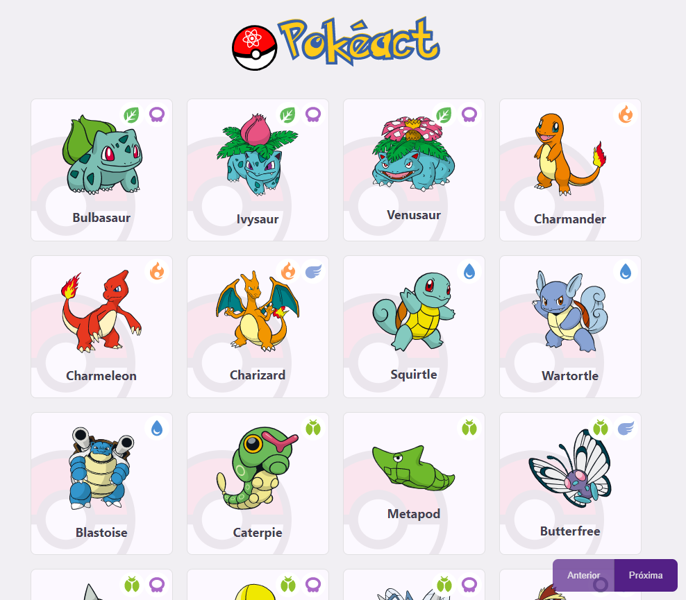

# Pokeact

Listagem e Paginação de pokemon utilizando a Poke API.

Aplicação de estudo sobre fundamentos do React.

## Como usar

Clone o repositório

Rode o comando `yarn` para instalar as dependências

Rode o comando `yarn dev` para iniciar a aplicação

Rode o comando `yarn build` para compilar para o deploy